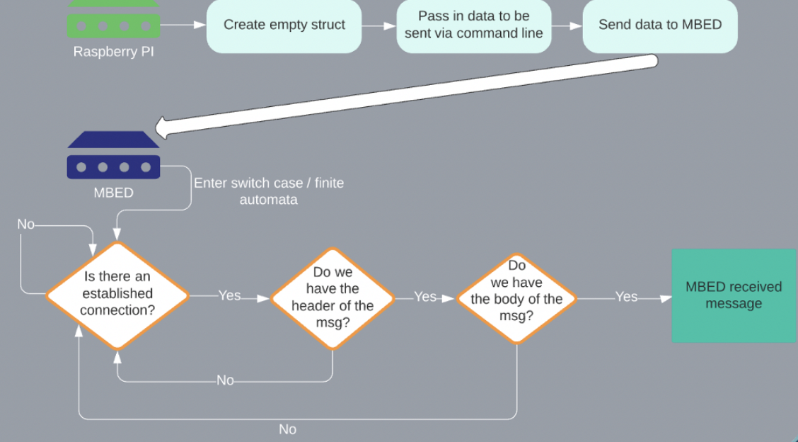

# **MBED ROS example:**
This is an implementation of using ROS with a Raspberry pi 3 and a GR-Peach. In this example we used a breadboard that has a switch connected to it, and the switch transmits signals to the MBED. The data that is sent back and forth is converted into message files that can easily be sent between the two devices.  Once the data has been converted, it is sent to the desired device over an ethernet connection.

The conversion program is a script that takes all of the message files in the directory, and converts them to C structs. The MBED can easily read the structs, and the Pi can easily turn the structs into ROS objects. 

The MBED is not a ROS node itself, but there is a message translation/conversion program to convert message files into files that can be sent to the Pi, and interpreted by ROS. 

Similarly, on the Pi  side these messages are read in and now we have the data that was sent from the MBED. This data gets published to ROS, and one can do whatever is needed with the ROS data. 

# Timing and Syncing the devices
Since both devices have their own respective time, we use an NTP server to have a synchronized time between the devices. We use a network time protocol(NTP) server on the Pi for the devices to connect to and have a synchronized time. 

The onboard times of the MBED and Pi are still used. Using the devices' onboard times allows for us to verify the messages are being published at the correct frequency and that the communication channel between the devices is working as intended. 

Using NTP and the devices' onboard times allows for easy synchronization and debugging of the system.

# The Process
## MBED -> PI

1. First, the mbed connects to the server the Pi is hosting. 
2. Once there is a connection, the message to be sent is populated with the information the Pi is expecting to receive. 
3. After the message is completed, the message is sent down the socket. 
4. The Pi then receives the message
5. After receiving, the message is converted into a ROS object containing the data that was sent
6. Finally, the data is published to ROS.

## Pi -> MBED 

1. Once the connection has been established, we can start sending data. Initially, the Pi will create an empty struct for the message that is being sent. This struct can be filled in via command line or in your ROS program
2. Modify the struct to be sent via command line
3. When ready, send the newly created struct down the socket to the mbed.
4. Once the mbed receives the message, it enters a finite automaton to process the message.
5. Check to make sure the connection between the devices is secure. If secure, move on. If not secure, continue checking for connection. 
6. Check to see if the header of the struct/message was sent. If we have received the header, then we can move on to check if the body of the struct/message was sent. If we do not have the header, then we check to make sure that our connection is secure. 
7. Check to see if we got the body of the message. If we got the body of the message, then the message has been properly received and the MBED can get ready for the next message to be sent.

# Circuit
The circuit we used for this project:

